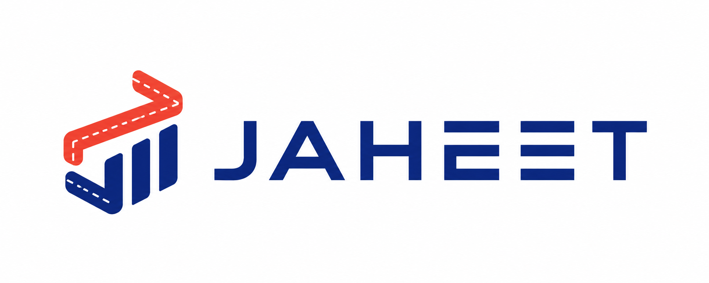

<p align="center">
  <a href="README.id.md">🇮🇩 Bahasa Indonesia</a>
</p>

<p align="center">
  <picture>
    <source media="(prefers-color-scheme: dark)" srcset="assets/04_BANNER_DARK.png">
    
  </picture>
</p>

<p align="center">
  
</p>

<h1 align="center">Jaheet</h1>
<p align="center"><strong>ERP Ringan untuk Clothing &amp; Konveksi</strong></p>

<p align="center">
  
  
  
  
  
  
</p>

---

## About

Jaheet is a lightweight ERP for clothing and convection businesses — production management, inventory, purchasing, payments, and full double-entry accounting in one system. Not just a tailoring app. Think **Shopify for Indonesian garment MSMEs**.

## Logo Philosophy

The Jaheet logo works because it doesn't look like a "traditional tailor" — it reads as a **modern operational system** for the garment industry.

### 1. Stitch Pattern = Garment Production

The coral zig-zag shape above represents a stitch line, production workflow, and fabric moving through the manufacturing process. The dashed white line adds precision — it reads as **textile workflow**, not fashion lifestyle.

### 2. Bar Chart = Accounting &amp; Business Intelligence

Three vertical indigo bars form a growth chart — accounting reports, SaaS dashboard, inventory metrics. This matters because Jaheet is an ERP system, not a craft tool. The bars anchor the identity as **software-first, not craft-first**.

### 3. Overall Silhouette = The Letter "J"

The coral stitch shapes the top, the blue bars form the foundation — together they abstract the letter **"J"**. Ideal for memorability, app icon recognition, favicon, and physical branding (embroidery, stickers, packaging).

### 4. Upward Direction = Growth &amp; Scale

The diagonal composition rising to the right carries visual psychology of growth, efficiency, and MSME scale-up. Subconsciously, the user reads: **"my business is rising."**

### 5. Color Philosophy

| Color | Hex | Meaning |
| --- | --- | --- |
| **Indigo** | `#2D3A8C` | Trust, accounting, precision, enterprise reliability |
| **Coral** | `#E8553E` | Creativity, production energy, human craftsmanship, Indonesian textile culture |

Indigo keeps the identity stable and professional. Coral prevents it from feeling cold and corporate — it stays close to the convection community.

### 6. Why This Beats Traditional Garment Logos

Most garment logos use scissors, sewing machines, or fashion silhouettes — too literal, too legacy-UMKM, not scalable as SaaS. This logo is **abstract, modular, and tech-oriented** — clean enough for a SaaS startup, unique enough to remember, and flexible across mobile apps, dashboards, invoices, production labels, and packaging.

> It doesn't look cheap when the company scales up.

---

## Quick Start

**Prerequisites:** Go 1.23+, Node.js 20+, pnpm, PostgreSQL 16 (or Docker), [Atlas CLI](https://atlasgo.io/getting-started)

```bash
git clone https://github.com/faisalaffan/jaheet.git
cd jaheet

# 1. Start database
docker compose up -d

# 2. Apply schema
cd backend && atlas schema apply --env local
go run ./cmd/api &        # API → http://localhost:8080

# 3. Start frontend
cd ../frontend && pnpm install && pnpm dev   # UI → http://localhost:5173
```

---

## Architecture

```
Frontend (React 19 + Tailwind + shadcn/ui)
  └── Pages → Axios + TanStack React Query → /api/v1

Backend (Go + Chi)
  └── Handler → Service → Repository → PostgreSQL
                    └── Auto-Journal Engine
```

## License

MIT
